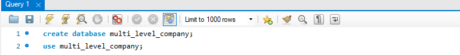
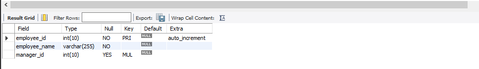
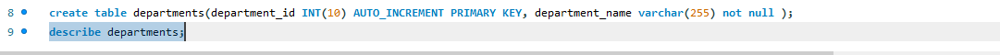
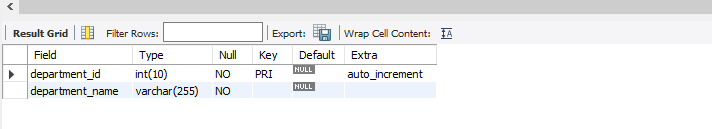
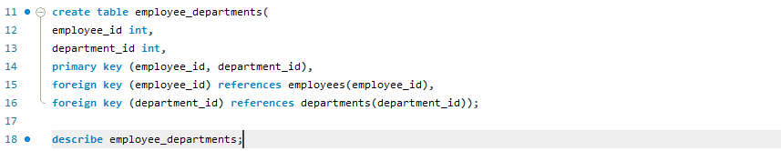
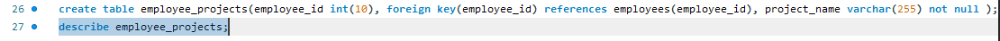
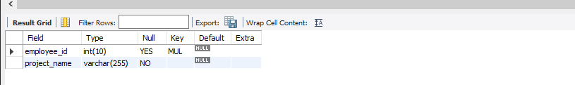
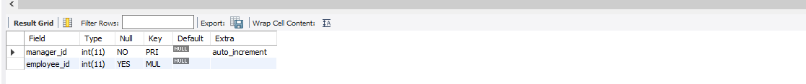

# Finals Lab Task 1. MySQL Basics

## Create a Database 

## Create a Table Employees

Output:

## Create a Departments Table

*Output:*

## Create a Employee_Departments Table

Output:

## Create a Employee_Projects Table

Output:

## Create Managers Table

Output:

## ER Diagram:

