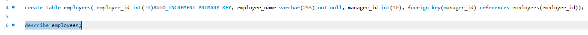
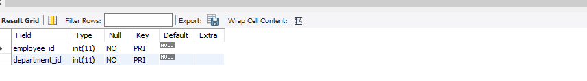

# Finals Lab Task 1. MySQL Basics

## Step 1: Create a New Database
- This creates a new container called multi_level_company where all your company data will live.
- Tell MySQL to Use That Database, This tells the system to focus on multi_level_company for the following tasks.

## Step 2: Make an Employees Table
- This table will store:
- An ID number for each employee (employee_id) that grows automatically.
- The employee’s name (employee_name).
- The ID of their manager (manager_id), which links back to another employee in this same table (so we know who manages whom).

# Output:

- This just shows the list of columns and their types in the employees table.

## Step 3: Make a Departments Table
- This table stores company departments:
- Each department gets a unique ID.
- Each department has a name.

# Output:

- Check the Departments Table Structure
- Shows what columns and data types the departments table has.

## Step 4: Create a Employee_Departments Table
- This table connects employees and departments.
- Since an employee can belong to many departments, and each department can have many employees, this table keeps track of all those connections.

# Output:

## Step 5: Create a Employee_Projects Table
- This table lists projects and which employees are working on them.
- Each row tells you which employee works on which project.

# Output:

## Step 6: Create a  Managers_Table
- This table stores a list of managers.
- Each manager has:
- A unique manager_id.
- An employee_id pointing to who they are in the employees table.

# Output:

## ER Diagram:

