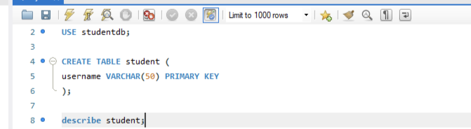
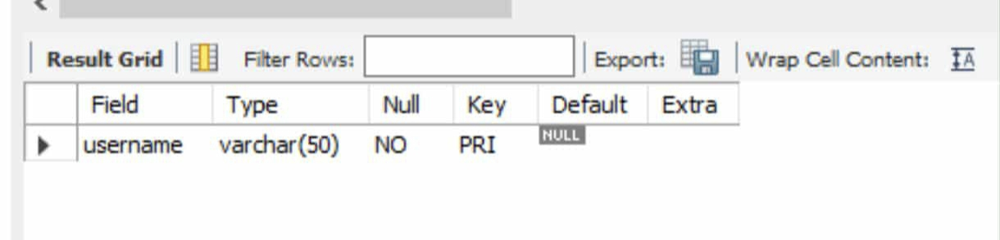

# Finals Lab Task 2. MySQL Basics

## Step 1: Create the database and use it:
- This makes a new database called studentdb where all your tables will live.
- USE studentdb; means you're now working inside this database.

## Step 2: Create the student table:
- This table holds students
- Username is a text field up to 50
characters.
- It's the primary key, so each username
must be unique and identifies one
student.

# Output:

- Check the structure of student
- This shows what columns the table has
and their types.

## Step 3: Create the assignment table:
- This table holds assignments.
- Shortname is a unique name for the assignment (primary key).
- due_date is the deadline and cannot be empty (NOT NULL).
- url can hold a link related to the assignment, and it can be empty 

# output: 

## Step 4: Create a table named_submission
**Create a table named submission with these columns:**
username(student who submits)
shortname (assignment identifier)
version(submission version number)
submit_date (date submitted, required)
data (submission content as text)

Define a primary key combining username, shortname, and version to allow multiple versions per assignment per student.
**Set foreign keys:**

username references the student table
shortname references the assignment
table
.**USe ON DELETE CASCADE and ON UPDATE CASCADE on** foreign keys so that if a student or assignment is deleted or
updated, related submissions are automatically deleted or updated to maintain consistency.

# output:

