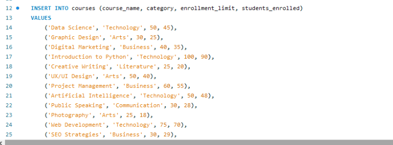
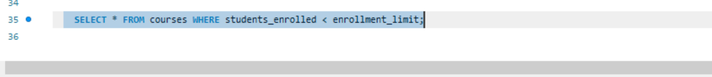
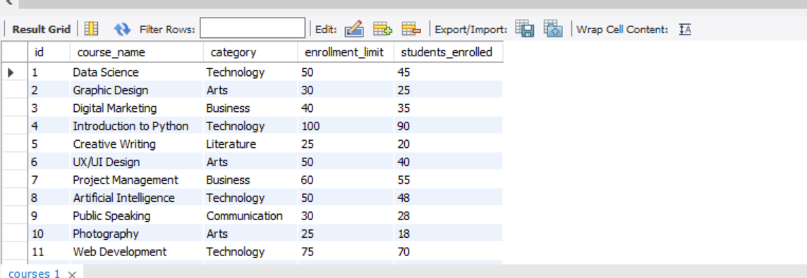
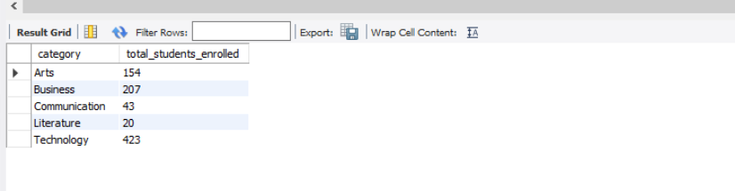
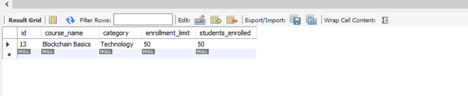
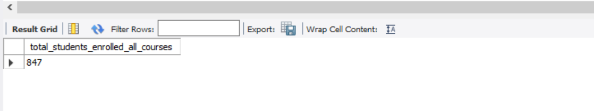
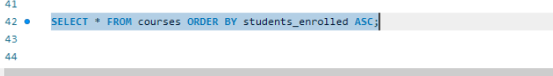
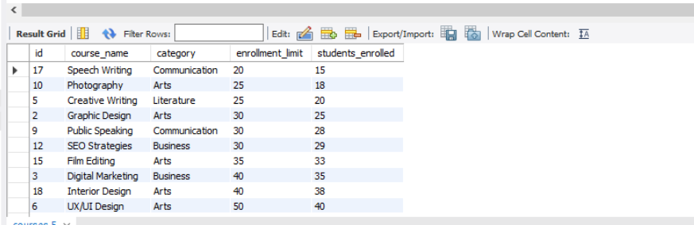

# Finals Task 3-1 Using SELECT CLAUSE

## Step 1: Create the database and use it And Create the courses Table

 

## Step 2:  Insert Course Data
What it does:
This adds 20 different courses into the courses table, each with a name, category, enrollment limit, and number of students currently enrolled.

 

## Step 3: Get Courses with Available Spots
- This retrieves all courses that still have open slots, meaning the number of students enrolled is less than the allowed limit.

 

**Output:**
 

## Step 4: Group by Category and Sum Enrollments
- This groups the courses by category and calculates the total number of students enrolled in each category.

 

**Output:**

 

## Step 5: Get Fully Enrolled Courses
- This selects all courses where enrollment is full — i.e., students_enrolled is exactly equal to enrollment_limit.

**Output:**

 

## Step 6: Get Total Enrollments Across All Courses
- This calculates the total number of students enrolled across all courses combined.

 

**Output:**
 

## Step 7: Sort Courses by Enrollment (Ascending)
This lists all courses, ordered from the lowest to highest number of students enrolled.

 

**Output:**

 

