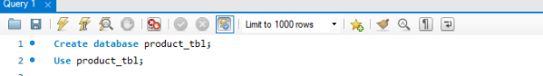
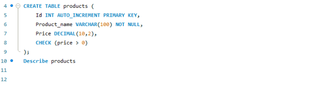
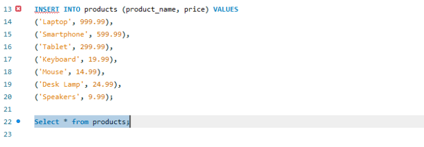
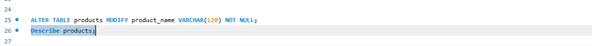
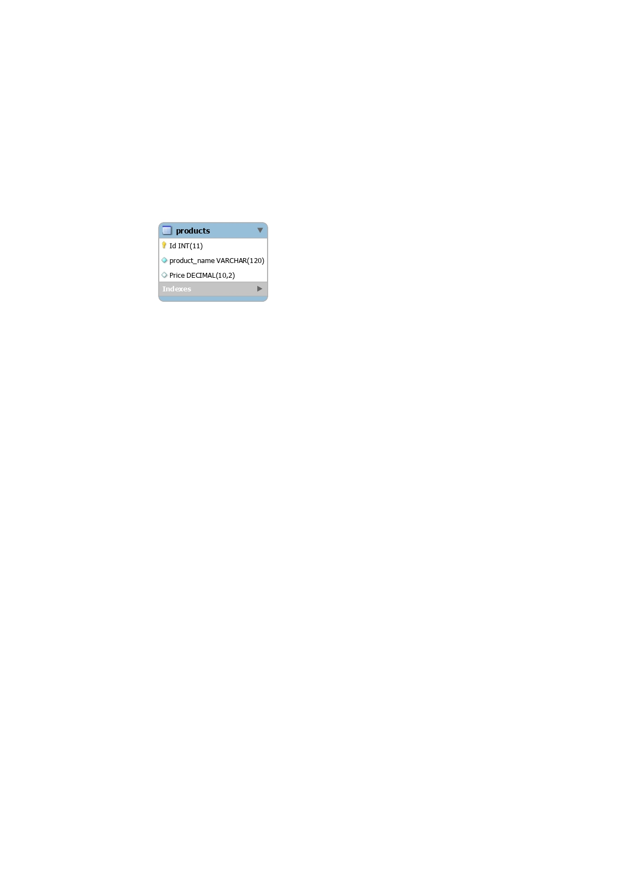

# Finals Task 3. Table Manipulation

## Step 1: Create the database and use it:
- This makes a new database called studentdb where all your tables will live.
- USE studentdb; means you're now working inside this database. 
 

## Step 2: Create a table named products
- id as the primary key (auto-incremented)
- product_name as a text(max 100 characters, not allowed to be empty)
- price as a deciamal number 
- A check constraint to make sure the orixe is greater than 0

# Output:

## Step 3: Insert Valid products only 
- from the list of 10 products, only insert the 7 products with positive prices.

# output: 

## Step 4 Update the product_name column
- Change the column product_name to allow up 120 characters instead of 100

# Output:

# ER Diagram: 

