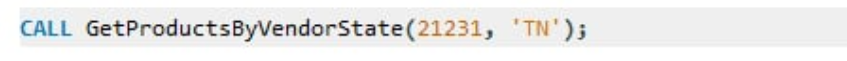

## Step 1: CREATE VIEW: vendors_code, vendors name, product description, p_indate (from 2002 onwards)

**to see the result:**

**Output:**

## Step 2: CREATE VIEW: All products priced between 100-150

**Output:**

## Step 3: CREATE VIEW: Compute TOTAL_PRICE (P_ONHAND × P_PRICE) for vendors 21344, 23119, 24288

**to see the result:**

**Output:**

## Step 4: CREATE STORED PROCEDURE: Update 'Bryson,Inc.' to 'Bryson and Co'

**to see the result:**

**Output**

## Step 5: CREATE FUNCTION: Accepts v_code and v_state, returns product descriptions and prices

**to see the result:**

**Output:**

