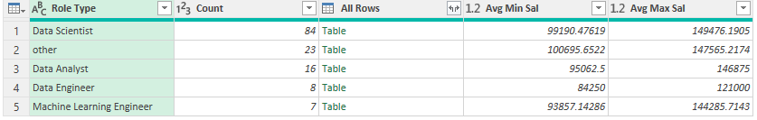
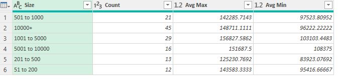
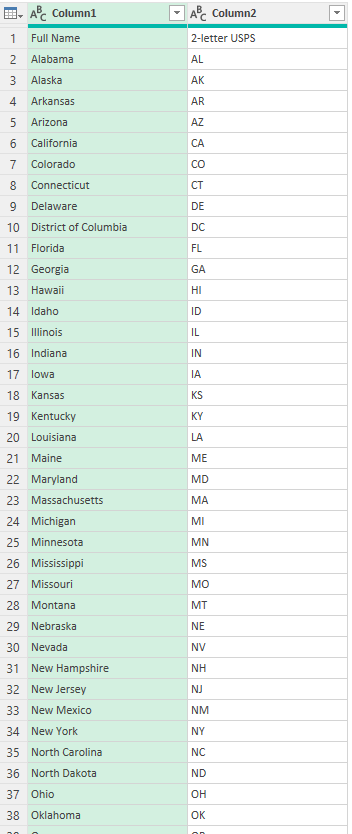
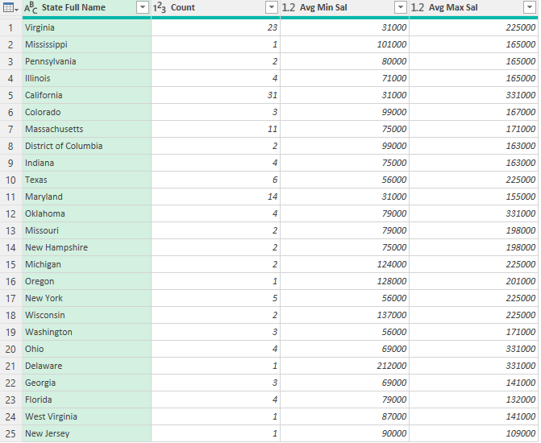
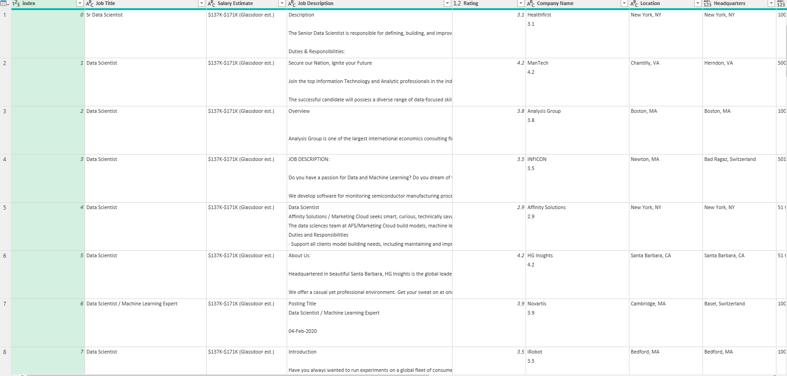
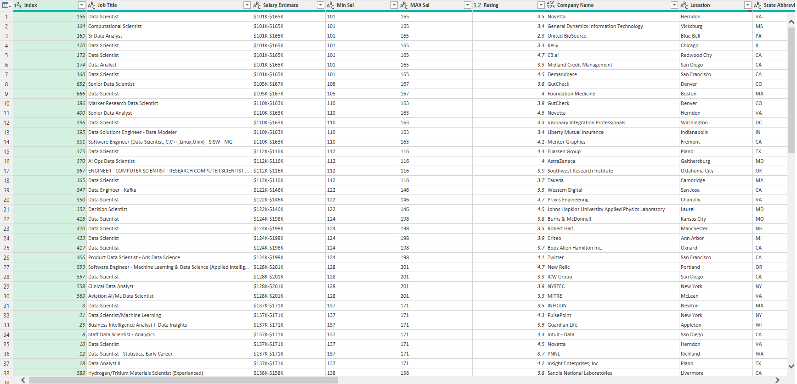

### Step-by-Step Summary for Data Cleaning and Transformation Using Power Query Editor:

---

### Part 1: Data Cleaning Tasks

1. Load the Dataset:
   - Open Excel.
   - Go to the Data tab, click New Query, then choose Open File, and select the `Uncleaned_DS_jobs.csv` file.
   - Load the data and open it in the Power Query Editor by selecting Transform Data.

2. Duplicate Raw Data:
   - Right-click on the Uncleaned DS Jobs query in the Queries pane and choose Duplicate.

3. Salary Estimate Column:
   - Remove all characters after the open parentheses `(` in the Salary Estimate column:
     - Go to the Transform tab.
     - Click Extract, then choose Text Before Delimiter.
     - Type `(` and click OK.
   
4. Create Min and Max Salary Columns:
   - Min Sal Column:
     - Select Salary Estimate column.
     - Go to Add Column → Column from Examples → From Selection.
     - Type `101` in the first cell, then press Enter.
     - Rename the column to Min Sal.
   - Max Sal Column:
     - Repeat the above steps to create the Max Sal column.

5. Role Type Column:
   - Go to Add Column → Custom Column.
   - Name the column Role Type and input the formula:

 
   - Change the data type of the Role Type column to Text.

6. Split Location Column:
   - First, handle outliers in the Location column by creating a Custom Column using the following formula:
     
   - Click OK to create the Location Correction column.
   - Then, Split Column by Delimiter (comma) in the Location Correction column.
   - Rename the split columns to Location Correction 1 and Location Correction 2.
   - Filter and clean the Location Correction 2 column by replacing "Anne Rundell" with "MA" and renaming it as State Abbreviations.

7. Handle Size Column:
   - Split the Size column into MinCompanySize and MaxCompanySize using the same method as for Salary Estimate.
   
8. Handle Negative Values:
   - Competitors Column: Filter all instances of `-1`.
   - Revenue Column: Filter out all rows where the value is `0`.
   - Industry Column: Filter all instances of `-1`.
   
9. Clean Company Name:
   - Remove any unnecessary "Rates" after the company name in the Company Name column.

10. Remove Description Column:
    - Delete the Description column.

11. Copy Applied Steps:
    - Go to the Home tab.
    - Click Advanced Editor and copy all the steps as proof of your data cleaning activities.

---

### Part 2: Reshape and Group the Data

1. Duplicate Raw Data:
   - Right-click on the Uncleaned DS Jobs query and select Duplicate.
   - Rename the duplicate query to Sal By Role Type dup.

2. Select and Modify Columns for Role Type Salary:
   - Choose the following columns: Role Type, Min Sal, and Max Sal.
   - Change the data type of Min Sal and Max Sal to Currency.
   - Multiply Min Sal and Max Sal by `1000` (Go to Transform, then Standard → Multiply → Type `1000`).
   - Group By the Role Type column (under Transform → Group By).
   - In the Group By window, select Min Sal and Max Sal, and choose Average as the operation.

3. Create a Reference for Salary by Role Size:
   - Right-click on the Uncleaned DS Jobs query and select Reference. 
   - Rename the reference query to Sal By Role Size ref.
   - Select Size, Min Sal, and Max Sal columns.
   - Change the data type of Min Sal and Max Sal to Currency.
   - Multiply Min Sal and Max Sal by `1000`.
   - Group By the Size column (under Transform → Group By).
   - In the Group By window, select Min Sal and Max Sal, and choose Average as the operation.

4. Mapping Other Files (State Mapping):
   - Open the State Mapping workbook and select the columns needed.
   - Right-click in the Queries Pane, select New Query → Open Workbook → Choose State Mapping and click OK.
   - Merge the State Abbreviation from State Mapping and Uncleaned DS Jobs.
   - After the merge, rename the column to State Full Name.
   - Filter out null or blank state abbreviations.

5. Create a Reference for Salary by State:
   - Right-click on the Uncleaned DS Jobs query and select Reference.
   - Rename the query to Sal By State ref.
   - Select State Full Name, Min Sal, and Max Sal.
   - Change the data type of Min Sal and Max Sal to Currency.
   - Multiply Min Sal and Max Sal by `1000`.
   - Group By the State Full Name column (under Transform → Group By).
   - In the Group By window, select Min Sal and Max Sal, and choose Average as the operation.

6. View Dependencies:
   - Go to the View tab and click Dependencies
   - Verify that all the queries are correctly linked and show their dependencies and references.

### Final Queries:
The final set of queries should include:
## Sal By Role Type dup
   
   
## Sal By Size ref
 
 
## State
   
   
## Sal By State ref

## Uncleaned DS Jobs

## clean data

--- 

By following these steps, you'll be able to clean, transform, and group the dataset to answer the three questions provided in the task.
